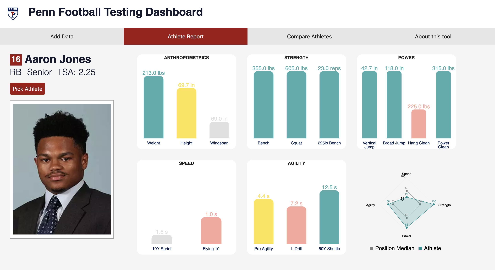

# Penn Football Offseason Testing Dashboard

## Introduction
Building a successful football roster takes more than four years of planning and decision-making. This project aims to develop both a data pipeline and an interactive, user-friendly visualization tool that leverages off-field performance data to generate comprehensive athlete profiles. These profiles support comparison, benchmarking, and progress tracking across multiple seasons. Using R for data preparation, Firebase for data storage and retrieval, and JavaScript for front-end development, the project processes over four years of performance data and presents each athlete’s relative strengths and weaknesses within their position group. The tool also enables coaches to easily enter and update athlete data, as well as select athletes for side-by-side comparison, making it a practical resource for informed decision-making from recruitment to game day. Many thanks to Professors Xiaojiang Li and Mjumbe Poe for their insightful guidance and technical mentorship throughout the project, and to Coach Miguel Rivera for the data and many hours of thoughtful, iterative feedback.

## Usage 
### Adding or updating athlete data: **Add Athletes**

The **“Add Athletes”** page lets you update existing athlete profiles or add new ones. Use the **“Saved Athletes”** button to find and edit current records. To add a new athlete, fill out the form with a **Name–Position** combination that doesn't already exist in the system.

---

### Viewing athlete profiles: **Athlete Report**

Use the **“Saved Athletes”** button to view detailed reports for individual athletes. Charts show where an athlete ranks—by percentile—on each stat compared to their position group. For example, an **80th percentile** score means they performed better than 80% of their peers. The number above each bar shows the **raw score**. Hover over a bar to see the **group median** and **percentile**.

---

### Comparing two athletes

The **“Compare Athletes”** page lets you view two athletes side-by-side, showing their raw testing results and measurements. Use the dropdowns to select who you'd like to compare.
